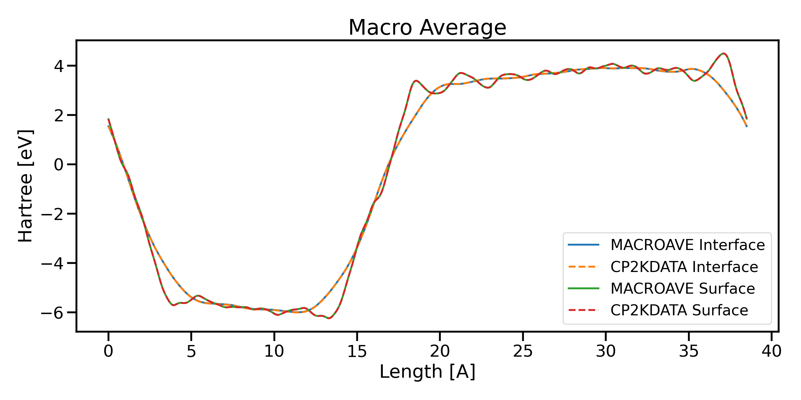

# CP2KDATA


[](https://github.com/robinzyb/cp2kdata/actions/workflows/ci.yml)[](https://coveralls.io/github/robinzyb/cp2kdata)


Python Package to postprocess cp2k data.

including cube file, pdos file, output file

- [CP2KDATA](#cp2kdata)
- [Idea List](#idea-list)
- [TO DO](#to-do)
- [Installation](#installation)
  - [Processing Output File](#processing-output-file)
    - [Basick Usage](#basick-usage)
    - [Parse ENERGY_FORCE Outputs](#parse-energy_force-outputs)
    - [Parse GEO_OPT Outputs](#parse-geo_opt-outputs)
    - [Parse MD outputs](#parse-md-outputs)
  - [Plug-in for `dpdata`](#plug-in-for-dpdata)
  - [Processing Cube File](#processing-cube-file)
  - [Processing PDOS File](#processing-pdos-file)
    - [Processing Single PDOS File](#processing-single-pdos-file)
    - [Quickplot of  PDOS Files in Single Point Energy Calculation](#quickplot-of--pdos-files-in-single-point-energy-calculation)

# Idea List
1. manipulate cube, pdos data
2. extract information from output
3. generate standard test input and directory
4. generate nice figures 
5. plugin for dpdata
   
# TO DO
cli interface

# Installation

```bash
pip install .
```


## Processing Output File

### Basick Usage
One can use `Cp2kOutput` class to parse cp2k `output file`, which is the standard output from cp2k code. Depending on run types, required files may be more than a standard output. For example, if you parse `md` outputs, you may ask to provide additional `Project-1.ener`, `Project-pos-1.xyz`, and `Project-frc-1.xyz` files to obtain `energies`, `position`, and `forces` information. Detail usages are provided in the following subsections.

```python
from cp2kdata import Cp2kOutput
cp2k_output_file = "cp2k_output"
cp2koutput = Cp2kOutput(cp2k_output_file, path_prefix=".")
# path_prefix is the directory where the cp2k_output is
# show the brief summary on stdout
print(cp2koutput)
```

```stdout
Cp2k Output Summary

--------------------------------------

Cp2k Version       : 6.1

Run Type           : ENERGY_FORCE

Atom Numbers       : 30

Frame Numbers      : 1

Force in Output    : Yes

Stress in Output   : Yes

Element List       : Fe1  Fe2  O    

Element Numb       : 6    6    18   
--------------------------------------
```

### Parse ENERGY_FORCE Outputs
```python
from cp2kdata import Cp2kOutput
cp2k_output_file = "output_energy_force"
cp2koutput=Cp2kOutput(cp2k_output_file)
# get the version of cp2k
print(cp2koutput.get_version_string())
# get the run type
print(cp2koutput.get_run_type())
# symbols with true element
print(cp2koutput.get_chemical_symbols())
# symbols with your set in input
print(cp2koutput.get_chemical_symbols_fake())

```

### Parse GEO_OPT Outputs
```python
from cp2kdata import Cp2kOutput
cp2k_output_file = "output_geo_opt"
cp2koutput=Cp2kOutput(cp2k_output_file)
# get the version of cp2k
print(cp2koutput.get_version_string())
# get the run type
print(cp2koutput.get_run_type())
# get potential energy
print(cp2koutput.get_energies_list())
# get initial coordinates
print(cp2koutput.get_init_atomic_coordinates())
# symbols with true element
print(cp2koutput.get_chemical_symbols())
# symbols with your set in input
print(cp2koutput.get_chemical_symbols_fake())
# get the geometry optimization information
print(cp2koutput.get_geo_opt_info())
# quick plot of geometry optimization information 
cp2koutput.get_geo_opt_info_plot()
```


### Parse MD outputs
On parsing MD outputs, you can choose parse *with* or *without* standard outputs. Three additional files, `Project-1.ener`, `Project-pos-1.xyz`, and `Project-frc-1.xyz` files, are required to obtain `energies`, `position`, and `forces` information. 

If you parse with standard outputs, `Cp2kOutput` can collect full information from outputs. In specific, cell information and kind symbols can be obtained. 

```python
from cp2kdata import Cp2kOutput
cp2k_output_file = "output_md"
cp2koutput=Cp2kOutput(cp2k_output_file)
```

Alternatively, you may parse without standard outputs. Consequently, you will loss the `cell` and `atomic kind` infromations. When parsing without standard outputs, you must manually set the optional argument `run_type` as `md`, otherwise it will raise error.

```python
from cp2kdata import Cp2kOutput
cp2k_output_file = "output_md"
cp2koutput=Cp2kOutput(run_type="md")
```

## Plug-in for `dpdata`
`Cp2kData` support plug in for dpdata. When installed with `pip`, `Cp2kData` automatically installs plug in for `dpdata`.

For usages of `dpdata`, we refer to https://github.com/deepmodeling/dpdata. 

Currently, we only support two flavors of format for `dpdata`. One is `cp2kdata/e_f` for parsing `ENERGY_FORCE` outputs, the other is `cp2kdata/md` for parsing `MD` outputs. 

An Example for parsing `ENERGY_FORCE` outputs:
```python
import dpdata

dp = dpdata.LabeledSystem("cp2k_e_f_output", fmt="cp2kdata/e_f")
print(dp)
```

An Example for parsing `MD` outputs:
```python
import dpdata
dp = dpdata.LabeledSystem(".", cp2k_output_name="output", fmt="cp2kdata/e_f")
print(dp)

```

## Processing Cube File

```python
from cp2kdata.cube import Cp2kCube
cube_file = "xxx.cube"
mycube = Cp2kCube(cube_file)

# structure is include in cube file
# you can obtain ASE atoms from cube
stc = mycube.get_stc()
print(stc)

# get Planar average data without interpolation.
pav_x, pav = mycube.get_pav(axis="z", interpolate=False)
# get Planar average data  with interpolation. the number of interpolation point is 4096
pav_x, pav = mycube.get_pav(axis="z", interpolate=True)

l1 = 4.8 # length for first periodicity
l2 = 4.8 # length for second periodicity
ncov = 1 # set 1 if the system is slab-vacuum system.
ncov = 2 # set 2 if the system is interface.
# get Macro average data without interpolation of the original data.
mav_x, mav = mycube.get_mav(l1=l1, l2=l2, ncov=ncov, interpolate=False)
# get Macro average data with interpolation of the original data.
mav_x, mav = mycube.get_mav(l1=l1, l2=l2, ncov=ncov, interpolate=True)

# quick plot
mycube.quick_plot(axis="z", interpolate=False, output_dir="./")
```
The Planar Average and Macro Average results are benchmarked from MACROAVE used in 
[Siesta and Abinit](https://docs.siesta-project.org/projects/siesta/reference/macroave.html)
and shown in the following figures




## Processing PDOS File

### Processing Single PDOS File

```python
from cp2kdata.pdos import Pdos
dosfile = "Universality-ALPHA_k2-1_50.pdos"
mypdos = Pdos(dosfile)
dos, ener = mypdos.get_dos()
```

### Quickplot of  PDOS Files in Single Point Energy Calculation

```python
from cp2kdata.pdos import quick_plot_uks, quick_plot_rks
Calculation_dir = "./"
# if uks calculation use this
quick_plot_uks(Calculation_dir)
# if rks calculation use this 
quick_plot_rks(Calculation_dir)
```

